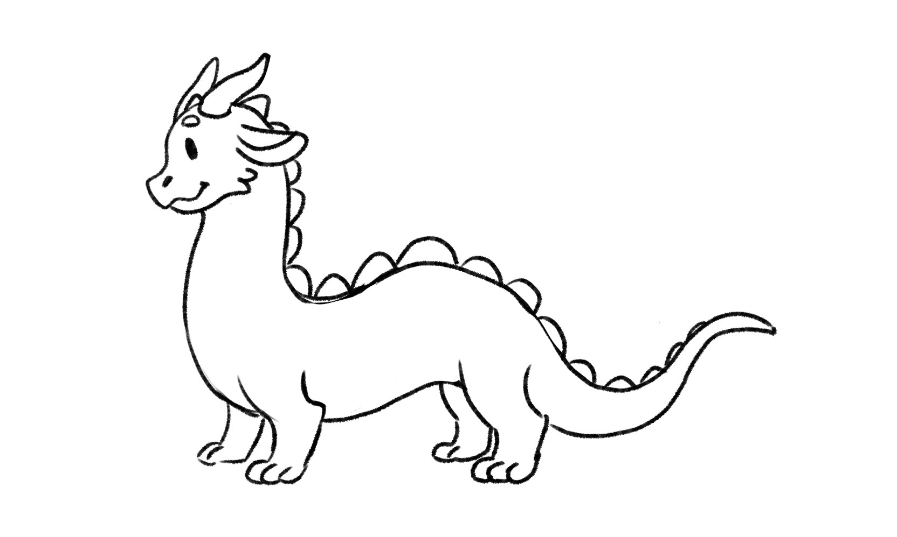
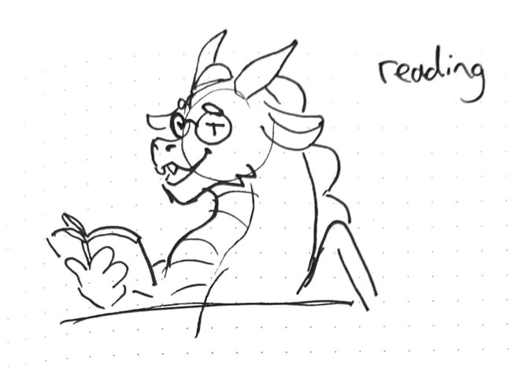
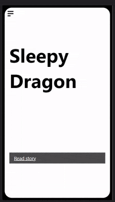
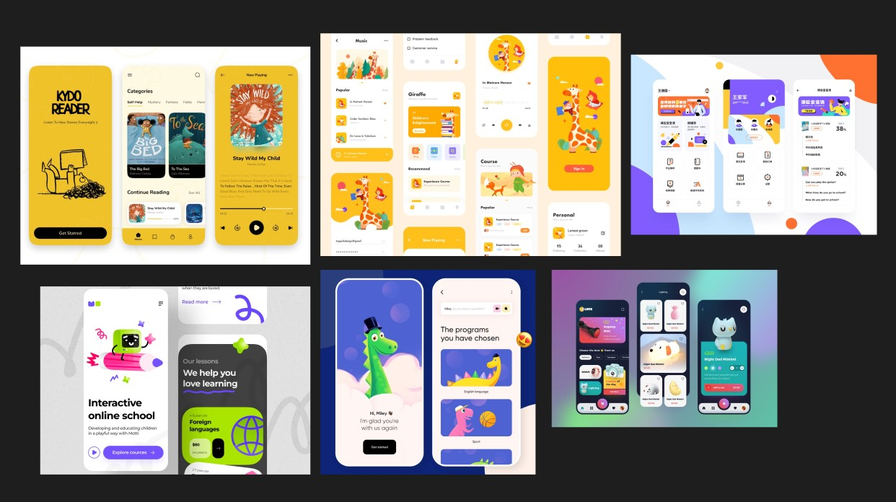
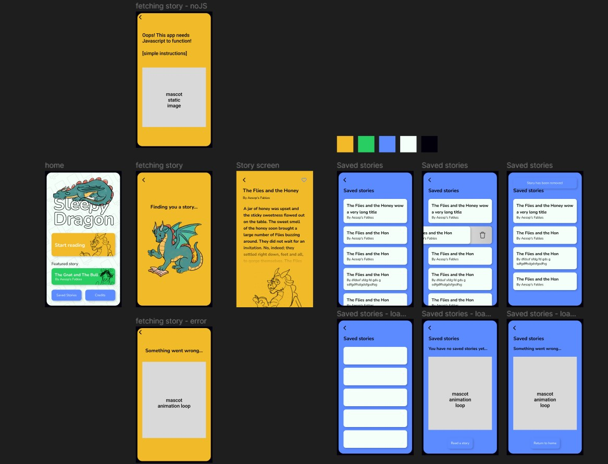
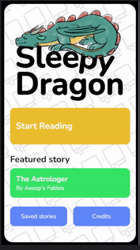

[](https://skillicons.dev)

<br>

### 🐛 Found a bug? Let me know with an issue! 🐛

<br>

### Make sure to check out the branches for the latest version.

<br>

### Table of contents
- [📖 Sleepy Dragon, A Single Page App for short stories. 📖](#-sleepy-dragon-a-single-page-app-for-short-stories-)
    - [🪪 Businesscard 🪪](#-businesscard-)
    - [📱 Single Page App 📱](#-single-page-app-)
    - [📋 Debrief 📋](#-debrief-)
    - [✔️ Personal goals ✔️](#️-personal-goals-️)
  - [👤 User story 👤](#-user-story-)
  - [🤔 Primary functions 🤔](#-primary-functions-)
  - [🐉 Mascot 🐉](#-mascot-)
    - [✏️ Mascot Design Sketches ✏️](#️-mascot-design-sketches-️)
    - [✏️ Mascot State Sketches ✏️](#️-mascot-state-sketches-️)
  - [📊 Flowchart 📊](#-flowchart-)
  - [🎞️ Wireframes 🎞️](#️-wireframes-️)
  - [📱 Prototype v1 📱](#-prototype-v1-)
  - [🎨 Rive 🎨](#-rive-)
  - [📱 Prototype v2 📱](#-prototype-v2-)
  - [🎨 App design 🎨](#-app-design-)
  - [📱 Prototype v3 📱](#-prototype-v3-)
  - [Refactoring](#refactoring)


<br>
<hr>
<br>

# 📖 Sleepy Dragon, A Single Page App for short stories. 📖

Sleepy Dragon is a mobile single page app that fetches random stories from an API that can be read.

<br> 

This repository contains projects made for the minor Web Design & Development. This repository includes mainly two projects.

<br>
<hr>
<br>

### 🪪 Businesscard 🪪
You can view my businesscard using this link:
https://sasjakoning.github.io/Sleepy-Dragon-WAFS/visitekaartje

<br>

### 📱 Single Page App 📱
The single page app is the main project of this repository. The coming sections in this readme all involve the Single Page App.

<br>

### 📋 Debrief 📋

During three weeks of the course Web App From Scratch, I will design and develop a Single Page App(SPA) based on a self-chosen user story. This SPA will be based on data fetched from an API.

I will design, build and test a prototype in at least three iterations. I will write this SPA in vanilla HTML, CSS and JS and will avoid using frameworks and libraries. Micro libraries are allowed in necessary.

<br>

### ✔️ Personal goals ✔️

For this project I wanted to experiment with API's and go more in depth in using Rive for my project. I also want to store data in local storage so the SPA can remember certain things the user has done.

<br>
<hr>
<br>


## 👤 User story 👤

The user story I have chosen for this project is:

> "As a parent, I want to find random short stories to entertain my child before bedtime so I don't have to continuously search for new stories."

<br>

## 🤔 Primary functions 🤔

There are a few primary functions in this app. The user can:

- Read a random story
- Like/save a story
- Read a story that has been saved
- (optional) Use text to speech to have the story read to them
- (optional) Use a dark/light mode
- (optional) Use a search function to find a specific story

<br>

## 🐉 Mascot 🐉

The primary audience of this app is children. To make the app more fun and appealing to children, I have created a mascot for the app. The mascot is a dragon that is called Sleepy. The mascot is used in the logo and in the app itself.

<br>

### ✏️ Mascot Design Sketches ✏️

I made several sketches for the design of the mascot. I wanted the design to be appealing to children and to be fun. I also wanted the design to be simple and not too complex since I will be animating the mascot. I ended up going for a design that has more rounded shapes and a more friendly look.


<br>

After making sketches on paper i continued to make designs for the character digitally. I made sever iterations and continuously received feedback from fellow students.





Once I refined the design to my liking, I created several color variations of the mascot. I wanted to make sure that the mascot would be appealing to children and still be unique.


<br>

### ✏️ Mascot State Sketches ✏️

Now that I had a design for the mascot, I made a few sketches where the character would pose for different states of the app. 




## 📊 Flowchart 📊

In order to get the structure and functionality of the app properly set up, I created a flowchart that show the different states and functions that can be used.


<br>

## 🎞️ Wireframes 🎞️

I made several wireframes for the app. I wanted to make sure that the app was easy to use and that the user could easily find the functions they wanted to use.


The sketches gave me a general idea of where I wanted the interface to go. For more detailed wireframes I used Figma. I made a wireframe for the home page, the story page, saved story page and several states of the app.


<br>
<hr>
<br>

## 📱 Prototype v1 📱

The first prototype has a very bare bones design where I only focus on the functionality of the app. There is a home page and a story page which has loading, error and succes states. There is also an extra page which warns the user that the app runs on Javascript, in case they don't have Javascript enabled.

<br>

There were a few things I was unfamiliar with or hadn't done before. I had never made a webapp before that runs on a single page but still "simulates" multiple pages by using hash routing. I started off coding this using normal `<button>`'s and assigning eventlisteners to them. Later on, I got thought to use `<a>` tags instead, which I applied in version 2 of the prototype.

<br>

I also discovered that there is a native way to use components in Javascript applying frameworks. This caught my interest and I decided to do more research on it. As it turned out, generally people use webcomponents and then apply bare text as html which sits inside the javascript file like so:

```javascript 
const template = document.createElement('template');
template.innerHTML = `
  <style>
    h1 {
      color: red;
    }
  </style>
  <h1>Hello World</h1>
`;
```
This however, defeated the purpose of using web components for me. I wanted to be able to use seperate HTML and CSS files for my components. I found a way to do this by using the `fetch()` function to get the HTML and CSS files and then applying them to the component. The code I used to do this is a little complex but comes down this: I create a variable that has the list of html templates that I want to insert. I run a function that fetches these files and create new components for each of them using names that are stated within the html files themselves. I can then append these to the DOM by simply using `document.createElement("template-name")`. In case there is content that needs to be inserted into the component, I can call these using `element.shadowRoot.querySelector( '[slot="slot-name"]');` and then insert the content using `element.textContent`.

<br>

I'm quite happy with what I learned about web components and how I applied them to this project. In practice I probably won't be using them as much as I did in this project, but it was a fun learning experience and gave me more understanding about how frameworks like React and Vue work.

<br>

This is what version 1 of the prototype looks like:


<br>
<hr>
<br>

## 🎨 Rive 🎨

While I was busy coding the main functionalities of the app, I also started working on drawing and animating the mascot using [Rive](https://rive.app/). Rive is a tool that allows you to animate vector and raster graphics specially made for the web. It works really well in the context of Motion Design where previously an animator had to draw their graphics in Illustrator, import them into After Effects and animate them, export them using Bodymovin and then import them into a web project using Lottie. Rive allows you to do all of this in one place. It also allows you to animate your graphics using a state machine, which enables the user to create complex animations including interactions.

<br>

I previously used Rive before in a few projects and I'm very excited about it which is why I'm using it again for this app.
Below is the first animation I made for the mascot. This animation was good practice however the drawing turned out to be way too horizontal to fit wel on a phone screen.


<br>
<hr>
<br>

## 📱 Prototype v2 📱

Version 2 of the prototype is mainly focussed on refactoring the code. I switched to using hashes, routes and modules. Using modules helped me a lot when it came to the readability of the code. It was already coming close to turning into spaghetti code.

This is what version 2 of the prototype looks like:



<br>
<hr>
<br>

## 🎨 App design 🎨

At this point in the process I didn't spend much time designing the actual interface yet. Now that the functionality of the app is past it's first stage, I can could focusing on the design. I wanted the app to look friendly and child focussed. Even though the app wont specifically be used by children(But their parents), I wanted to make sure that the app would be appealing to them.

<br>

There were a few designs I found online that caught my attention. I used these as reference for the app design.



<br>

I made several versions of the app design. It didn't take long for me to figure out which colors I wanted to use but the actual layout and detail of the design took me a bit longer. After showing the iterations to my peers I got some good feedback and was able to improve the design.


<br>

Below is the final design of the app. I'm quite happy with how it turned out. I think it's a good balance between playful and easy to handle.



## Refactoring

On friday 24-02-2023 I had a meeting with my coach. During this meeting we discussed the app and the progress I had made so far. He gave me some good feedback and I decided to refactor the code a bit. The main point he gave me during this feedback sessions is to pay attention to the way my code was structured. At that point my code worked like "waterfall" code. which meant I had a function that that did something in a separate module, that then fired another function that did something in another module and so on. This made the code hard to follow. 

<br>

To improve readability of my code I started refactoring my code to not use functions within functions and avoid jumping from one module to another without returning to the main Javascript file first. 

<br>
<hr>
<br>

## 📱 Prototype v3 📱

Version 3 of the prototype is the final version of the prototype. I implemented the final design and continued working on perfecting the code and different states of the UI stack. 

<br>

<br>


During work on this version I had a design critique session with a fellow student. There were a few things that needed work:

- The swipe function the saved stories page is able to swipe in the wrong direction
- The treshold for the swipe function is too high and needs to be lowered.
- When the user swipes below the treshold, the story should return to its original position. This however did not yet work.
- When there are more saved stories on the page than the screen can show, the user should be able to scroll down to see the rest of the stories.
- "Start reading" Should be renamed to "Read random story" for clearer understanding.
- The dragon animation on the story screen may be a bit too distracting and large.

Each of these points were turned into Github issues and I worked on them one by one.


## 📱 Final version 📱

The final version of the app is the version that I will be presenting. I have implemented the majority the feedback I got from the design critique session and I have also fixed a few bugs that I found during testing.

<br>

### [Check out the demo video on Youtube](https://youtu.be/8K8vvHagBew)


<br>
<hr>
<br>

## 📚 Final thoughts 📚

I'm quite happy with the result of this project. Being able to create a web app from scratch (haha) and figure out the basics of Javascript frameworks helped me get a better view on how web development works. I'm also happy with the design of the app. I think it's a good balance between playful and easy to handle. There are some major things I learned which include the use of web components, templates, hashes, routes and modules. I also got some more practice in implementing Rive animations.